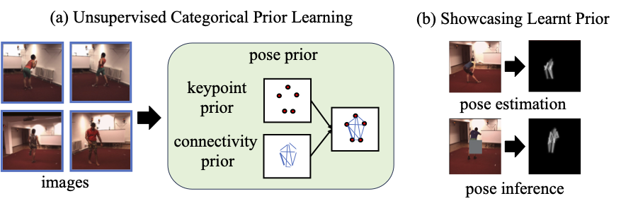
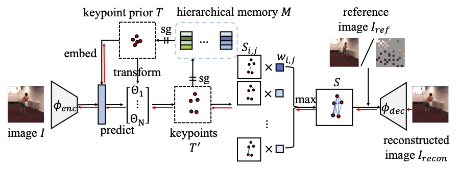
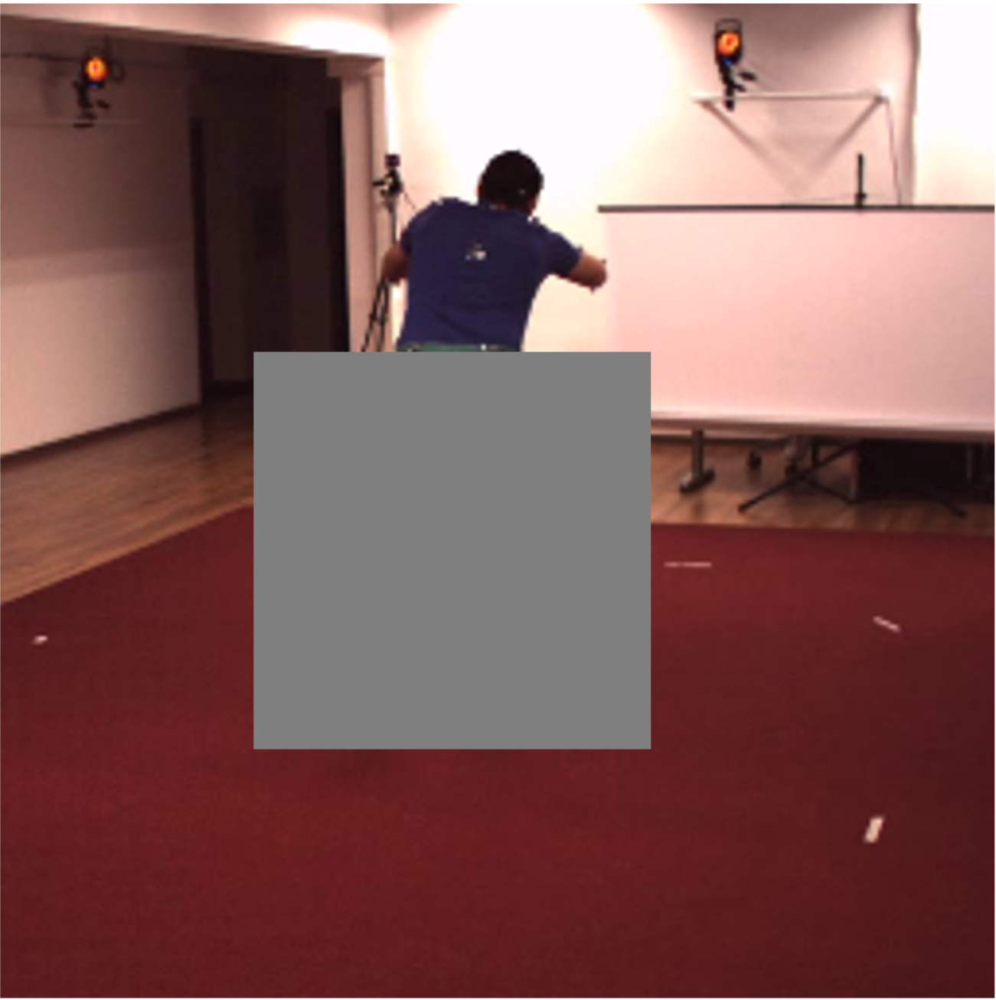
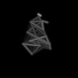
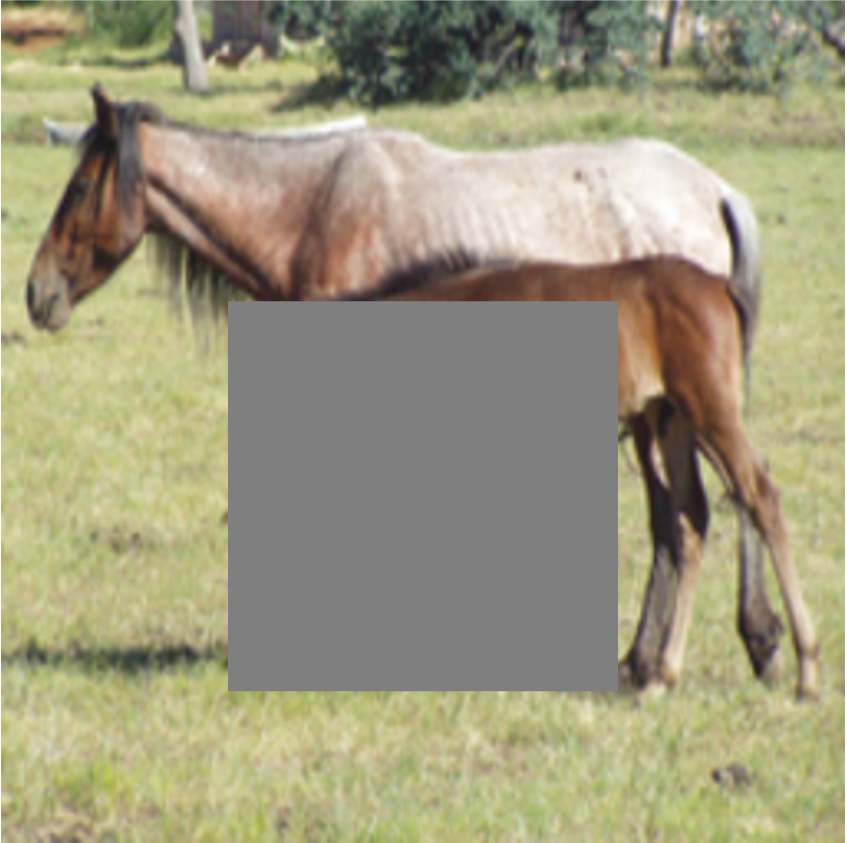
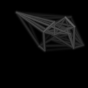
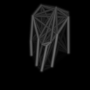
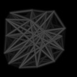

# Pose Prior Leaner

This repository contains the official implementation of the ICLR 2026 paper: 

[Pose Prior Learner: Unsupervised Categorical Prior Learning for Pose Estimation](https://arxiv.org/pdf/2410.03858.pdf)

Ziyu Wang, Shuangpeng Han, Mengmi Zhang

Access to our poster [HERE](https://docs.google.com/presentation/d/1l98a7232TkAwq5p9fbEW-Bu5LkrpBSBR/edit?usp=sharing&ouid=105149501031691727088&rtpof=true&sd=true) and presentation video [HERE](https://youtu.be/a9gl9S3gPgE).
## Abstract
A prior represents a set of beliefs or assumptions about a system, aiding inference and decision-making. In this paper, we introduce the challenge of unsupervised categorical prior learning in pose estimation, where AI models learn a general pose prior for an object category from images in a self-supervised manner. Although priors are effective in estimating pose, acquiring them can be difficult. We propose a novel method, named Pose Prior Learner (PPL), to learn a general pose prior for any object category. PPL uses a hierarchical memory to store compositional parts of prototypical poses, from which we distill a general pose prior. This prior improves pose estimation accuracy through template transformation and image reconstruction. PPL learns meaningful pose priors without any additional human annotations or interventions, outperforming competitive baselines on both human and animal pose estimation datasets. Notably, our experimental results reveal the effectiveness of PPL using learned prototypical poses for pose estimation on occluded images. Through iterative inference, PPL leverages the pose prior to refine estimated poses, regressing them to any prototypical poses stored in memory.
<div align=left></div>

## Pose Prior Learner Model
<div align=left></div>

## Environment Setup
The basic environment contains these packages:
- Python 3.12.9
- torch 2.7.0
- torchvision 0.22.0
- pytorch-lightning 2.5.0

Other dependencies can be installed as needed.

## Dataset
The [Taichi](https://github.com/AliaksandrSiarohin/motion-cosegmentation), [Human3.6m](http://vision.imar.ro/human3.6m/description.php), [CUB](http://www.vision.caltech.edu/visipedia/CUB-200-2011.html), [11k Hands](https://sites.google.com/view/11khands), [Horse2Zebra](https://www.kaggle.com/datasets/balraj98/horse2zebra-dataset) and [Flower](https://www.robots.ox.ac.uk/~vgg/data/flowers/102/index.html) can be found on their websites.
We provide the Youtube Dog Video dataset [here](https://drive.google.com/drive/folders/1J3NWlrrVtgHMgHfFBMhEniqHnyHbl2Zo?usp=drive_link).

## Pre-trained Models
The pre-trained models can be downloaded from [Google Drive](https://drive.google.com/drive/folders/1nh9HSDwN3BZP3XDQDiXXHy7X14DsqPuA?usp=drive_link).

## Training & Testing
To train the model from scratch, please follow the steps below:
- Modify the ``DATA_DIR`` in ``dataset/xxx.py`` to your own.
- Run the command as shown in the following example.
```
sh script/train_h36m.py
```

To test the model:
- Modify the ``DATA_DIR`` in ``dataset/xxx.py`` to your own.
- Run the command as shown in the following example.
```
sh script/test_h36m.py
```

## Visualization under Occlusion with Iterative Refining
<table>
<tr>
<td align="center"></td>
<td align="center"></td>
<td align="center"></td>
<td align="center"></td>
</tr>

<tr>
<td align="center"></td>
<td align="center"></td>
<td align="center"></td>
<td align="center"></td>
</tr>
</table>

## Citation
If you find our paper and/or code helpful, please cite:
```
@article{wang2024pose,
  title={Pose Prior Learner: Unsupervised Categorical Prior Learning for Pose Estimation},
  author={Wang, Ziyu and Han, Shuangpeng and Zhang, Mengmi},
  journal={arXiv preprint arXiv:2410.03858},
  year={2024}
}
```